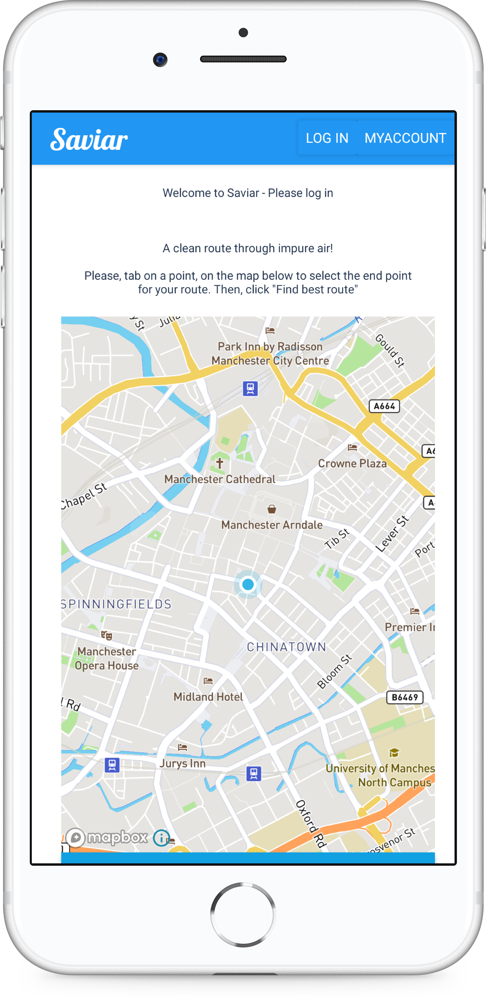

# Northcoders Final Project Frontend

This repo is the frontend repo for the Saviar Northcoders project group. The application that we built is a running app that will create a running route for the user, avoiding the most heavily polluted local areas. This frontend repo contains the source code necessary to create ios and Android apps with React Native.

|              | Link                                                                                                 |
| ------------ | ---------------------------------------------------------------------------------------------------- |
| Backend API  | [https://spheric-mesh-269023.nw.r.appspot.com/api](https://spheric-mesh-269023.nw.r.appspot.com/api) |
| Backend Repo | [https://github.com/tben140/be-nc-running-app](https://github.com/tben140/be-nc-running-app)         |

    

## Getting Started
